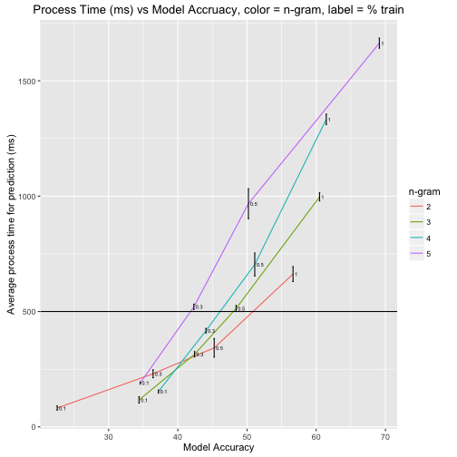
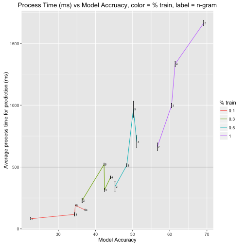

Coursera JHU Data Science Capstone 
========================================================
author: Jeffrey Williams
date: 28 DEC, 2016
autosize: true

Introduction
========================================================

- Presentation will highlight the approach and performance of a NLP application to predict text of short phrases 2-5 words in length.
- Application developed in Shiny which can be found at following URL:
  + https://jcwilliams378.shinyapps.io/NLP_coursera_capstone/
  + app uses alogrithm and presents histogram of the top words in addition to the top selected word
- Word predictions are scored based on the "Stupid Backoff" alogorithm and scoring method [1]

[1] Thorsten Brants et. al., 2007, Large Language Models in Machine Translation, Proceedings of the 2007 Joint Conference on Empirical Methods in Natural Language Processing and Computational Natural Language Learning, pp. 858–867, Prague.

Data Assembly & Cleaning
========================================================

- Data is pulled from corpora of text data coming from raw news, blog, and twitter sources.
- Data is cleaned using the "tm" package in R implementing text filtering included a Profanity filter based on 723 words
- Final cleaned data is sent to csv files after creation of 2-5 n-grams 
  + CSVs are aggregated into SQLite database (sqldf R package) on which queries were performed to retrieve next possible word.
- Data was sampled into test and training data
  + test data was randomly pulled 2% of the blended copora
  + training data was pulled at 0.1%, 0.3%, and 0.5%, and 1% of the blended corpora

Results
========================================================

***

Conclusion
========================================================

- We created a predictive tool capable of predicting the next word in a short phrase using the "stupid backoff" method for scoring and ordering the prediction. 
- Model accuracy vs performance speed was tested using different training set sizes and ultimate a training set of 0.3% of the total set was selected to achieve accuracies ranging from ranging from ~37-44% across n-grams ranging from 2-5 words with an expected prediction time of ~500 ms or less. The accuracy results reported are based on a test data set representing 2-5 n-gram phrases taken from a subset of 2% of the total blended data set provided where phrases occuring less than 4 times in frequency are dropped and the 'actual' expected result is defined as the highest frequency terminal word for the phrases recovered from the n-gram creation.
